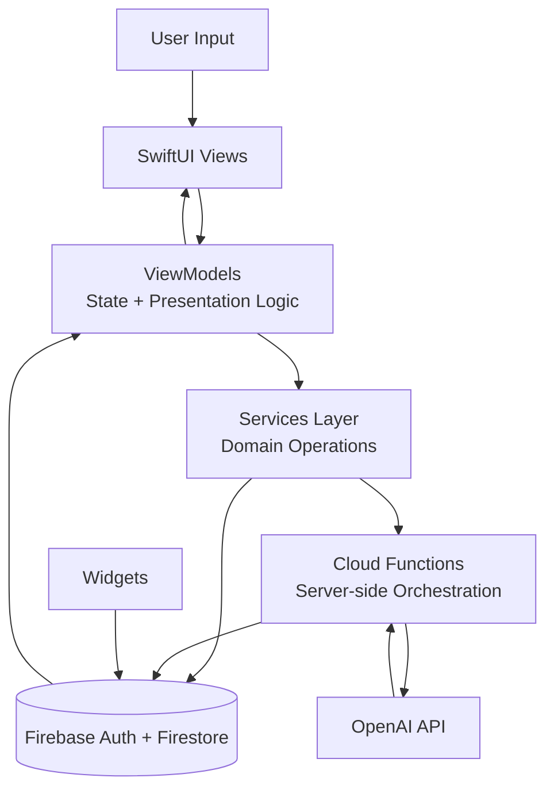

# GAINS

[-black)](#architecture-overview)

**AI-powered fitness and nutrition tracking app focused on consistency, clarity, and actionable coaching.**

GAINS is a mobile product that combines structured health tracking (calories, macros, hydration, body metrics, workouts) with AI-assisted coaching. The goal is to reduce friction in daily tracking while giving users practical, personalized feedback they can act on.

> This repository (`gains-showcase`) is a **public technical showcase**. The full production source code is private. This repo shares architecture, design decisions, sanitized artifacts, and safe examples for hiring evaluation.

## Table of Contents

- [Demo / Visuals](#demo--visuals)
- [Problem](#problem)
- [Feature Scope](#feature-scope)
- [Architecture Overview](#architecture-overview)
- [Engineering Decisions and Tradeoffs](#engineering-decisions-and-tradeoffs)
- [Challenges](#challenges)
- [Privacy and Security](#privacy-and-security)
- [Documentation Map](#documentation-map)
- [Roadmap Highlights](#roadmap-highlights)
- [Repo Scope Note](#repo-scope-note)

## Demo / Visuals

> Replace placeholders with your real app screenshots/GIFs before publishing.

| Visual | File Path | Intended Caption |
|---|---|---|
| Dashboard + daily summary | `assets/screenshots/dashboard.png` | Daily nutrition and progress snapshot designed for quick decision-making. |
| Meal logging flow | `assets/screenshots/meal-logging.png` | Fast-entry nutrition logging with macro and calorie updates. |
| AI Coach chat | `assets/screenshots/ai-coach.png` | Context-aware nutrition coaching and progress guidance. |
| Workout progress | `assets/screenshots/workout-progress.png` | Exercise tracking and progression visibility over time. |

- Demo GIF/video can be added in `assets/demo/` (or linked from YouTube/Loom).

## Problem

Many people understand *what* to do for fitness and nutrition but struggle with consistent execution. Existing tools often create three problems:

1. Tracking is fragmented across separate apps.
2. Feedback is generic and not tied to personal progress.
3. Logging friction breaks adherence over time.

GAINS is designed to address this by pairing structured tracking workflows with integrated AI guidance in a single mobile experience.

## Feature Scope

- **Calorie and macro tracking**
  - Meal logging and day-level targets.
  - Running totals for calories, protein, carbs, and fats.

- **Hydration tracking**
  - Quick add/update interactions for water intake.
  - Daily progress against hydration goals.

- **Body metrics tracking**
  - Weight and measurement history.
  - Trend visibility over time to reinforce behavior feedback loops.

- **Workout progress tracking**
  - Session logging and historical progression.
  - Structured view of training consistency.

- **AI Coach**
  - Nutrition Q&A.
  - Meal idea generation based on user context.
  - Macro guidance and progress-aware coaching prompts.

- **Firebase-backed data layer**
  - Cloud-synced user data and backend function orchestration.

- **Widget-ready architecture**
  - Designed to support glanceable home-screen progress surfaces.

## Architecture Overview

GAINS uses a modular SwiftUI client with Firebase-backed services and mediated OpenAI access via backend functions.
Mermaid source is also available at `assets/diagrams/system-architecture.mmd`.

### High-level data flow

1. User action updates local UI state through ViewModels.
2. ViewModels delegate domain operations to Services.
3. Services read/write user data via Firebase.
4. AI features route through backend functions to keep API credentials and policy checks server-side.
5. Updated state rehydrates the UI and widgets.

## Engineering Decisions and Tradeoffs

- **SwiftUI for rapid iteration and maintainable UI composition**
  - Pros: fast feature iteration, strong declarative model, easier component reuse.
  - Tradeoff: state complexity grows quickly without strict ViewModel boundaries.

- **Firebase for managed backend velocity**
  - Pros: integrated auth/data/functions, strong fit for mobile-first apps, reduced backend ops overhead.
  - Tradeoff: requires careful data-model planning to control query/read patterns at scale.

- **Modular app structure (Models / Services / ViewModels / Views / Widgets)**
  - Pros: clearer ownership boundaries, easier onboarding, safer feature expansion.
  - Tradeoff: more upfront architecture discipline and refactor cost.

- **Scoped AI integration instead of “AI everywhere”**
  - Pros: targeted value, lower complexity, better UX predictability.
  - Tradeoff: narrower initial AI surface area while broader capabilities are validated.

- **Iteration speed vs production rigor**
  - Early stages favored learning velocity and product feedback.
  - Architecture and backend boundaries were deliberately tightened as scope matured.

## Challenges

- Keeping a growing SwiftUI codebase modular while maintaining development speed.
- Managing state and async updates cleanly across tracking, analytics, and coaching surfaces.
- Building AI response flows that are useful, constrained, and stable in mobile UX contexts.
- Designing backend/client responsibility boundaries for secure AI operations.
- Planning data models to support current features without blocking future analytics depth.

## Privacy and Security

- User health and progress data is handled with a privacy-first mindset.
- Secrets and provider credentials are stored securely and **not** included in this public repo.
- AI calls are mediated through backend logic rather than exposing provider keys in the client.
- This repository intentionally omits private source code, internal prompts, and sensitive configuration.

No compliance certifications are claimed in this showcase repository.

## Documentation Map

- [Architecture Deep Dive](docs/architecture.md)
- [Product Decisions](docs/product-decisions.md)
- [AI Coach Design](docs/ai-coach-design.md)
- [Backend Overview](docs/backend-overview.md)
- [Future Roadmap](docs/future-roadmap.md)
- [Sample Data Models](docs/sample-data-models.md)
- [Sample API Contracts](docs/sample-api-contracts.md)
- [Example Flows (Pseudocode)](docs/example-flows.md)
- [Sanitized Project Structure](docs/sanitized-project-structure.md)

## Roadmap Highlights

- Barcode scanning for faster meal entry.
- HealthKit integration for richer activity signals.
- Expanded analytics and trend visualization.
- Smarter workout recommendations.
- Subscription and premium feature support.
- Offline-first caching/sync improvements.
- Better AI memory and personalization controls.

See [docs/future-roadmap.md](docs/future-roadmap.md) for timeline breakdown.

## Repo Scope Note

This repository exists to publicly document GAINS as an engineering case study.

- Full production codebase remains private.
- Shared artifacts are intentionally sanitized.
- The focus is demonstrating architecture thinking, tradeoffs, and implementation approach without exposing sensitive IP or user data.

## License

MIT License (see [LICENSE](LICENSE)).
