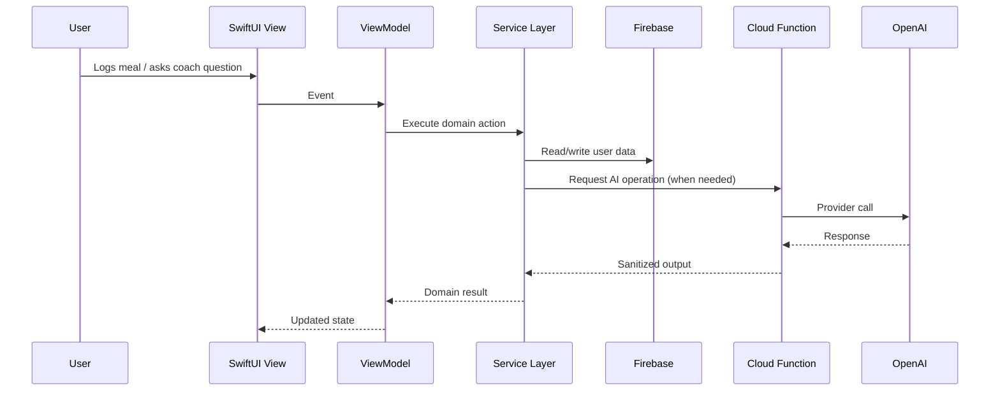

# GAINS Architecture (Public Showcase)

This document describes the technical structure of GAINS at a high level, with implementation details sanitized for public sharing.

## Goals

- Keep feature development fast without sacrificing maintainability.
- Separate product logic from UI rendering concerns.
- Keep sensitive operations (AI credentials, policy checks) off-device.
- Support incremental feature expansion (widgets, analytics, recommendations).

## System Layers

### 1) Presentation Layer (SwiftUI)

- SwiftUI views are responsible for layout, interaction, and display state.
- Views remain thin; business rules are delegated to ViewModels/Services.
- Reusable UI primitives are used to keep visual behavior consistent.

### 2) ViewModel Layer

- Owns screen-level state and user interaction orchestration.
- Coordinates async operations and transforms domain data into display models.
- Exposes deterministic UI-facing state (`loading`, `content`, `error`, etc.).

### 3) Services Layer

- Encapsulates domain workflows (meal logging, hydration updates, progress summaries, coaching requests).
- Provides a stable interface between presentation and backend APIs.
- Houses mapping/validation logic and shared domain transformations.

### 4) Data + Backend Layer

- Firebase Auth: identity and session management.
- Firestore: user-scoped persistent documents.
- Cloud Functions: privileged orchestration and external provider mediation.
- OpenAI integration: called from backend functions only.

### 5) Widget Surface

- Widgets consume precomputed/simplified data projections.
- Designed for quick-read status (daily calories, hydration, streak/progress snapshot).

## Module Boundaries (Sanitized)

- `Models/`: domain entities and lightweight value types.
- `Services/`: feature-specific domain services and backend gateways.
- `ViewModels/`: UI-facing state logic and interaction handlers.
- `Views/`: SwiftUI screens and reusable components.
- `Widgets/`: extension target for glanceable summaries.
- `functions/`: backend function endpoints and service adapters.

The structure is intentionally feature-friendly while preserving layer discipline.

## Data Flow

## State Management Approach

GAINS uses a screen-oriented state model with clear state ownership:

- View owns transient interaction state (focus, local input fields).
- ViewModel owns screen lifecycle state and async side effects.
- Services own domain orchestration and storage/network interactions.

Patterns used:

- Explicit loading/error/content states.
- Read-then-write operations routed through Services (not directly from Views).
- Derived values (totals/trends) computed in service/domain layers when possible.

This avoids coupling UI components directly to persistence and network concerns.

## Backend Interaction Points

Common backend touchpoints (sanitized):

- User profile and goal configuration.
- Daily nutrition and hydration logs.
- Body metric history.
- Workout session records.
- AI coaching request/response lifecycle.

AI workflows are intentionally mediated by backend functions to centralize:

- secret handling,
- request shaping,
- policy boundaries,
- and future rate/cost controls.

## Extensibility Strategy

The architecture is designed to support new features with minimal cross-module friction:

- Additive feature modules can plug into existing service patterns.
- New analytics surfaces can consume existing event/log schemas.
- Recommendation systems can evolve behind service/function contracts.
- Widget payloads can be versioned independently from core view logic.

## Tradeoffs

- Strong modularity improves long-term maintainability, but adds initial complexity.
- Managed backend services reduce ops burden, but require disciplined schema/query design.
- AI functionality adds value, but requires stricter controls around UX consistency and safety.

## Public Scope Limitations

To protect private IP and operational security, this document intentionally omits:

- full production code,
- internal prompt templates,
- exact database schema identifiers,
- environment configuration and secrets,
- proprietary heuristics/business logic.
